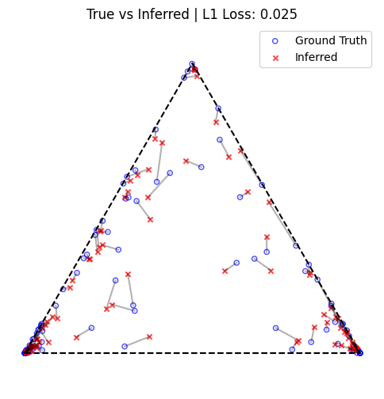

# dMMSB
Implementation of ["A state-space mixed membership blockmodel for dynamic network tomography"](https://arxiv.org/abs/0901.0135) in JAX.

This repository provides JAX implementations for both dynamic (dMMSB) and static (LNMMSB) mixed-membership blockmodels.



---

## Models

-   **dMMSB**: A dynamic mixed-membership blockmodel, as described in the paper. The implementation can be found in [`models/dMMSB.py`](models/dMMSB.py).
-   **LNMMSB**: A static version of the model using a logistic normal prior. The implementation is in [`models/LNMMSB.py`](models/LNMMSB.py).

## Installation

To run the examples, you need to install the required Python packages.

```bash
pip install jax jaxlib matplotlib
```

## Usage

The `examples` directory contains Jupyter notebooks demonstrating how to use the models.

-   **Dynamic Model**: See [`examples/dynamic.ipynb`](examples/dynamic.ipynb) for an example of how to generate data from and perform inference with the `dMMSB` model.
-   **Static Model**: See [`examples/static.ipynb`](examples/static.ipynb) for an example of the `LNMMSB` model.


